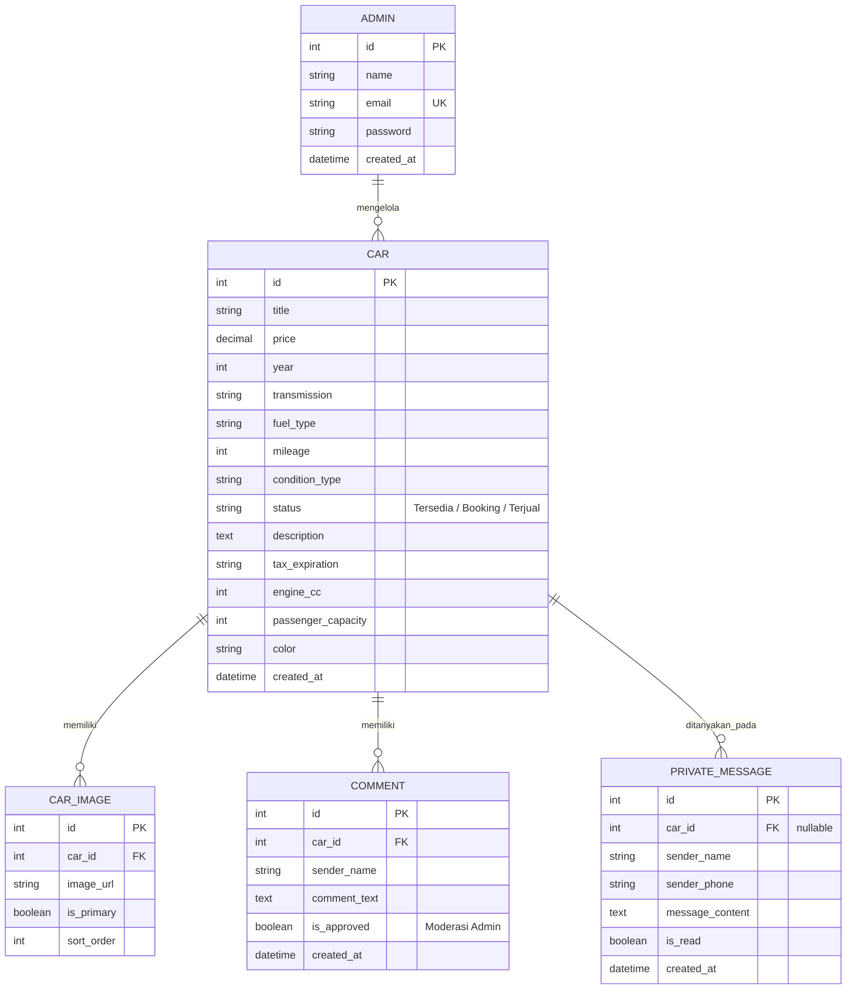
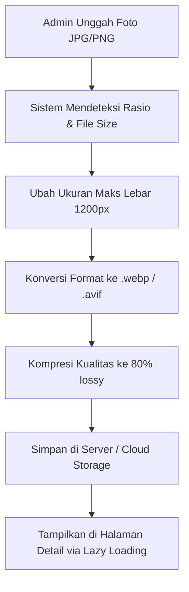

# TECHNICAL & UI/UX DESIGN DOCUMENT
## PROYEK: WEBSITE SHOWROOM "MOBILSECONDMEDAN"

---

## 🛠️ 1. STACK TEKNOLOGI & ARSITEKTUR

Untuk memastikan performa maksimal, SEO yang kuat (penting untuk showroom lokal agar muncul di Google Search), dan pengelolaan gambar yang efisien, sistem ini dirancang dengan arsitektur modern berlandaskan **Node.js (Next.js) + MySQL/PostgreSQL** atau opsi **Laravel Monolith**.

### Pilihan Stack Utama (Direkomendasikan)
*   **Frontend**: **Next.js (React) App Router** (Mendukung SSR/Server-Side Rendering untuk optimasi SEO detail mobil).
*   **Styling**: **Vanilla CSS / Tailwind CSS** (menggunakan font **Inter** dengan konfigurasi warna premium).
*   **Backend**: **Next.js Server Actions** atau API Routes (tanpa perlu backend terpisah jika menggunakan Next.js secara penuh), ATAU **Express.js (Node.js)** jika backend dipisah.
*   **Database**: **MySQL** / **PostgreSQL** untuk integritas data terelasi.
*   **Penyimpanan Media**: Local Storage (Public Folder) dengan middleware kompresi gambar otomatis, atau cloud storage seperti **Cloudinary / AWS S3** untuk skalabilitas.

---

## 📂 2. STRUKTUR DIREKTORI (PROFESIONAL MONOREPO)

Berikut adalah desain struktur folder proyek menggunakan pendekatan **Next.js + Express/Node.js** yang rapi dan terukur:

```text
mobilsecondmedan/
├── backend/                  # REST API & Database Server
│   ├── config/               # Konfigurasi Database & Auth
│   │   └── db.js
│   ├── controllers/          # Kontroler Logika Bisnis
│   │   ├── authController.js
│   │   ├── carController.js
│   │   ├── commentController.js
│   │   └── messageController.js
│   ├── middleware/           # Auth Guard & File Upload Compression
│   │   ├── auth.js
│   │   └── imageOptimizer.js
│   ├── models/               # Definisi Model Basis Data (MySQL/Sequelize/Prisma)
│   │   ├── Car.js
│   │   ├── Comment.js
│   │   ├── Message.js
│   │   └── User.js
│   ├── routes/               # API Endpoints
│   ├── uploads/              # Penyimpanan Gambar Mobil (.webp)
│   ├── server.js             # Entry Point Backend
│   └── package.json
│
├── frontend/                 # Next.js Application Client
│   ├── public/               # Asset Statis (Logo, Placeholder)
│   │   └── assets/
│   ├── src/
│   │   ├── app/              # Next.js App Router Pages
│   │   │   ├── layout.js     # Setup global font Inter & Layout Utama
│   │   │   ├── page.js       # Halaman Home (Bebas tabrak banner, maps, dsb.)
│   │   │   ├── katalog/      # Katalog dengan Filter & Urutan
│   │   │   ├── detail/[id]/  # Halaman Detail Mobil (Otospector info, Kredit Sim)
│   │   │   ├── bandingkan/   # Halaman Bandingkan (Maks 3 mobil)
│   │   │   └── admin/        # Panel Dashboard Admin (Login di /admin/login)
│   │   │       ├── login/
│   │   │       ├── dashboard/
│   │   │       └── pesan/
│   │   ├── components/       # Komponen UI Reusable (Inter Font)
│   │   │   ├── Navbar.jsx
│   │   │   ├── Footer.jsx
│   │   │   ├── CarCard.jsx
│   │   │   ├── CompareWidget.jsx
│   │   │   └── WhatsAppButton.jsx
│   │   ├── styles/           # CSS & Token Styling
│   │   │   └── globals.css
│   │   └── utils/            # Fungsi Helper (Format Rupiah, hitung Kredit)
│   └── package.json
└── README.md
```

---

## 🗄️ 3. SKEMA DATABASE (RELATIONAL SCHEMAS)

Sistem menggunakan database relasional untuk menjaga integritas data komentar dan pesan privat yang terhubung dengan entitas mobil.



### 📋 Spesifikasi Tabel (SQL DDL)

```sql
-- Tabel Admin
CREATE TABLE `admins` (
  `id` INT AUTO_INCREMENT PRIMARY KEY,
  `name` VARCHAR(100) NOT NULL,
  `email` VARCHAR(100) UNIQUE NOT NULL,
  `password` VARCHAR(255) NOT NULL,
  `created_at` TIMESTAMP DEFAULT CURRENT_TIMESTAMP
);

-- Tabel Mobil
CREATE TABLE `cars` (
  `id` INT AUTO_INCREMENT PRIMARY KEY,
  `title` VARCHAR(255) NOT NULL,
  `price` DECIMAL(15, 2) NOT NULL,
  `year` INT NOT NULL,
  `transmission` ENUM('Manual', 'Matik') NOT NULL,
  `fuel_type` ENUM('Bensin', 'Diesel', 'Listrik', 'Hybrid') NOT NULL,
  `mileage` INT NOT NULL,
  `condition_type` ENUM('Baru', 'Bekas') DEFAULT 'Bekas',
  `status` ENUM('Tersedia', 'Booking', 'Terjual') DEFAULT 'Tersedia',
  `description` TEXT NOT NULL,
  `tax_expiration` VARCHAR(50) DEFAULT NULL,
  `engine_cc` INT NOT NULL,
  `passenger_capacity` INT DEFAULT 7,
  `color` VARCHAR(50) NOT NULL,
  `created_at` TIMESTAMP DEFAULT CURRENT_TIMESTAMP
);

-- Tabel Galeri Foto Mobil
CREATE TABLE `car_images` (
  `id` INT AUTO_INCREMENT PRIMARY KEY,
  `car_id` INT NOT NULL,
  `image_url` VARCHAR(255) NOT NULL,
  `is_primary` BOOLEAN DEFAULT FALSE,
  `sort_order` INT DEFAULT 0,
  FOREIGN KEY (`car_id`) REFERENCES `cars`(`id`) ON DELETE CASCADE
);

-- Tabel Komentar Publik
CREATE TABLE `comments` (
  `id` INT AUTO_INCREMENT PRIMARY KEY,
  `car_id` INT NOT NULL,
  `sender_name` VARCHAR(100) NOT NULL,
  `comment_text` TEXT NOT NULL,
  `is_approved` BOOLEAN DEFAULT TRUE, -- Untuk moderasi spam
  `created_at` TIMESTAMP DEFAULT CURRENT_TIMESTAMP,
  FOREIGN KEY (`car_id`) REFERENCES `cars`(`id`) ON DELETE CASCADE
);

-- Tabel Pesan Privat
CREATE TABLE `private_messages` (
  `id` INT AUTO_INCREMENT PRIMARY KEY,
  `car_id` INT DEFAULT NULL,
  `sender_name` VARCHAR(100) NOT NULL,
  `sender_phone` VARCHAR(20) NOT NULL,
  `message_content` TEXT NOT NULL,
  `is_read` BOOLEAN DEFAULT FALSE,
  `created_at` TIMESTAMP DEFAULT CURRENT_TIMESTAMP,
  FOREIGN KEY (`car_id`) REFERENCES `cars`(`id`) ON DELETE SET NULL
);
```

---

## 🎨 4. DESIGN SYSTEM & ESTETIKA UI/UX (PREMIUM)

Desain UI dirancang agar terasa sangat mewah, profesional, dan bersih. Menghindari komponen AI generic yang mencolok dengan menerapkan aturan tata letak berikut:

### 4.1. Tipografi & Font
*   **Font Family**: `Inter, sans-serif` (dimuat via Google Fonts secara asinkron agar tidak memblokir loading).
*   **Scale**:
    *   *Hero Title*: `3.5rem` (56px) / Bold / Tracking Tight
    *   *Section Heading*: `2rem` (32px) / Semi-bold
    *   *Card Title*: `1.125rem` (18px) / Medium
    *   *Body Copy*: `0.95rem` (15.2px) / Regular (Line-height: 1.6)

### 4.2. Palet Warna (Luxurious Dark & Light Harmony)
Kami menggunakan paduan warna elegan seperti warna kromium logam, navy gelap, dan aksen emas/emerald untuk kesan tepercaya:

```css
:root {
  --color-brand-primary: #0F172A;   /* Navy/Slate Sangat Gelap (Mewah) */
  --color-brand-accent: #D4AF37;    /* Metallic Gold (Premium Accent) */
  --color-brand-success: #10B981;   /* Emerald Green (🟢 Tersedia) */
  --color-brand-warning: #F59E0B;   /* Amber Yellow (🟡 Booking) */
  --color-brand-danger: #EF4444;    /* Crimson Red (🔴 Terjual) */
  --color-bg-light: #F8FAFC;         /* Soft Grayish Light Background */
  --color-card-bg: #FFFFFF;
  --color-text-main: #1E293B;       /* Charcoal Text */
  --color-text-muted: #64748B;      /* Slate Gray Text */
  --border-radius-premium: 12px;
  --shadow-premium: 0 4px 20px -2px rgba(15, 23, 42, 0.08);
}
```

### 4.3. UI Visual Assets & Navigasi Medsos
1.  **Header Web & First Photo (Logo)**:
    - Logo berformat `.svg` premium beresolusi tajam.
    - Sesuai dengan instruksi, logo utama/banner 1 pada web dirancang terhubung langsung dengan postingan Instagram resmi ([Instagram Mobil Second Medan](https://www.instagram.com/mobilsecondmedan/)) atau TikTok ([TikTok Mobil Second Medan](https://www.tiktok.com/@mobilsecond.medan)) untuk meningkatkan konversi media sosial langsung dari interaksi pertama.
2.  **Efek Micro-Animation**:
    - *Hover effect* pada kartu mobil: Translasi ke atas sejauh `4px` dengan bayangan yang melebar halus (`transition: all 0.3s cubic-bezier(0.4, 0, 0.2, 1)`).
    - Status Badge (🟢 Tersedia) memiliki efek kedip lembut (*pulse animation*) untuk memikat perhatian mata pengunjung.

---

## 📷 5. STRUKTUR DAN WORKFLOW OPTIMASI GAMBAR

Untuk memastikan kecepatan rendering halaman detail dengan 10-15 foto multi-angle, backend mengimplementasikan pipeline kompresi gambar berbasis Node.js (`sharp` library) atau PHP (`intervention/image`).



---

## 💬 6. ALUR DISKUSI FORUM & CHAT PRIVAT DENGAN ADMIN

Fitur interaksi internal diimplementasikan agar pengunjung memiliki akses langsung berdiskusi mengenai unit tanpa meninggalkan platform.

### 6.1. Alur Komentar Publik
- Pengunjung menulis komentar -> Masuk database dengan status `is_approved = TRUE` (secara default langsung tayang).
- Di Admin Panel, admin memiliki kendali penuh (*Full Access*) untuk menghapus komentar kasar/sara dan menandainya sebagai spam.

### 6.2. Alur Pesan Privat (Internal Chat)
- Di halaman detail, pengunjung mengisi form pesan privat (Nama, No WhatsApp, Isi Pesan).
- Pesan terkirim dan disimpan di tabel `private_messages`.
- Admin mendapatkan indikator notifikasi di Dashboard Admin Panel.
- Saat admin mengklik pesan tersebut di dashboard, sistem menyajikan tombol **"Balas via WhatsApp"** yang secara otomatis memformat link API WhatsApp:
  `https://wa.me/62xxxxxxxxxx?text=Halo%20[NamaPengunjung],%20saya%20admin%20Mobil%20Second%20Medan%20ingin%20membalas%20pertanyaan%20Anda...`
